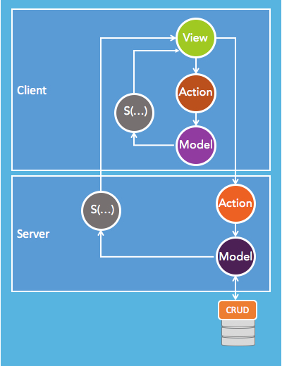

# MvcPHP
sdfsdf
```
$view = new View ( 
			new Model ( 
				new Controller ( $_REQUEST ) 
			) 
		);
$view->show ();
```

Картинка ниже хорошо иллюстрирует данный подход.
В данном простом случае Controller($_REQUEST) и есть Action, а State конформно отображается в Model так, что отдельная реализация не требуется




